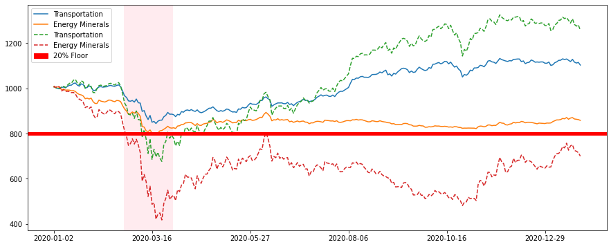

# cppi
Constant Proportion Portfolio Insurance
# Summary
I am calculating industry indixes from S&P500 stocks, modeling CPPI and comparing with industry returns
# Results
CPPI allows to calculate allocations to risky and "safe" assets based on the risk appetite and industry performance and change these allocations dynamically.


<br>


# Performance Comparison
Dynamic reallocation to STIP ETF reduced max drawdown by 17% and 38% for Transportation and Energy Minerals respectfully
### Bond + Equity combination
| Industry | Annualized Return | Annualized Vol | Sharpe Ratio | Max Drawdown |
|--------------|---|---|---|---|
|Transportation| 0.004125  |  0.029184 | -0.862939	  |  -0.17508 |
|Energy Minerals| -0.007116	  | 0.022741	  | -1.588453	  |-0.21078   |

### Pure Equity portfolio
| Industry | Annualized Return | Annualized Vol | Sharpe Ratio | Max Drawdown |
|--------------|---|---|---|---|
|Transportation| 0.009863	  |  0.079046 | -0.248029	  |  -0.348676 |
|Energy Minerals| -0.016292	  | 0.126969	  | -0.354979	  |-0.586560   |

# Quick Example
I used "robin_stocks" library to pull the prices for each stock in S&P500, their corresponsing sectors and capitalization. I found robin_stocks to be the most stable and reliable tool for pulling data for a large list of securities. <br>
In this example I want to give a quick example of how to perform CPPI algorithm only using free publickly available libraries such as "yfinance" and "yahoo_fin"

## Dependencies
```python
import pandas as pd
from datetime import date
import yahoo_fin.stock_info as si
import matplotlib.pyplot as plt
%matplotlib inline
import yfinance as yf
```
## Getting prices
As our risky assets we'll use SPDR S&P 500 ETF (SPY), which tracks performance of S&P500. We'll compare it to WisdomTree EM Quality Dividend Growth Fund (DGRE) to get a sence of exposure to Emerging Markets.<br>
We'll use Vanguard Short-Term TIPS ETF as our "safe" asset. We will increase allocation to TIPS as long as SPY and DGRE are dropping.
```python
hqualem_eq = yf.Ticker('DGRE').history(period='max') #WisdomTree EM Quality Dividend Growth Fund
hqualem_eq = hqualem_eq.add_suffix('_DGRE')

sp2 = yf.Ticker('SPY').history(period='max') #S&P500
sp2 = sp2.add_suffix('_SPY')

risky_price = pd.merge(hqualem_eq, sp2, left_index=True, right_index=True)
risky_price = risky_price.filter(like='Close')
ii = ['DGRE', 'SPY']
risky_price = risky_price.rename(columns={f'Close_{i}': i for i in ii})
risky = risky_price[['DGRE', 'SPY']].pct_change().dropna()


tips = yf.Ticker('VTIP').history(period='max') #Vanguard Short-Term TIPS ETF
tips = tips.add_suffix('_VTIP')

safe_price = tips.filter(like='Close')
safe_price = safe_price.rename(columns={'Close_VTIP': 'VTIP'})
safe = safe_price['VTIP'].pct_change().dropna()
```
## CPPI model

${V}_{risky} = m*(V - F)$ <br>
where
${V}_{risky}$ is the value of assets in the risky portfolio
$V$ is the starting value of the total portfolio
$F$ is the asset level below which the total portfolio should not fall and
$m \geq 1$ is the multiplier (how risky you wanna be) <br>
<br>
We are going to use STIP ETF as "safe" asset where $V - {V}_{risky}$ will be invested


